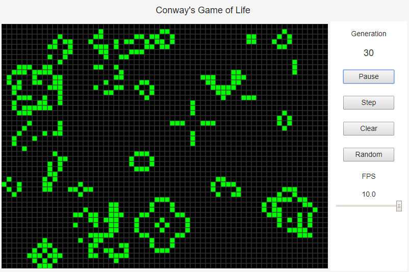

# GameOfLife

## Description

*Conway's Game of Life* available with web browser

About *Conway's Game of Life* ... [Wikipedia](https://en.wikipedia.org/wiki/Conway%27s_Game_of_Life)

## How to use

- Turn a cell on/off ... clicking 
- Play/pause continuous simulation ... "Play/Pause"
- Play simulation 1 step ... "Step"
- Clear all cells ... "Clear"
- Distribute cells randomly ... "Random"
    - "Clear" and "Random" buttons reset a generation count. 
- Change FPS ... Slider (10~100)
    - It probably contains an error. 

## Requirement

Web browsers compatible with HTML5 Canvas API

## License

